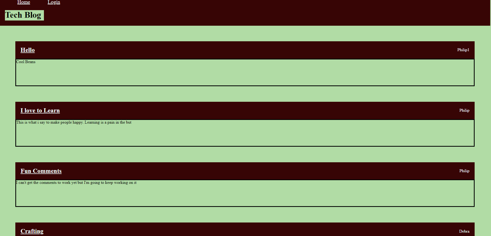
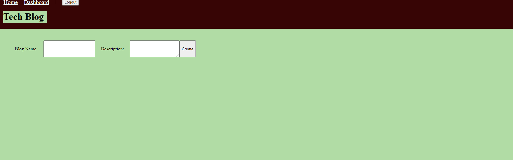
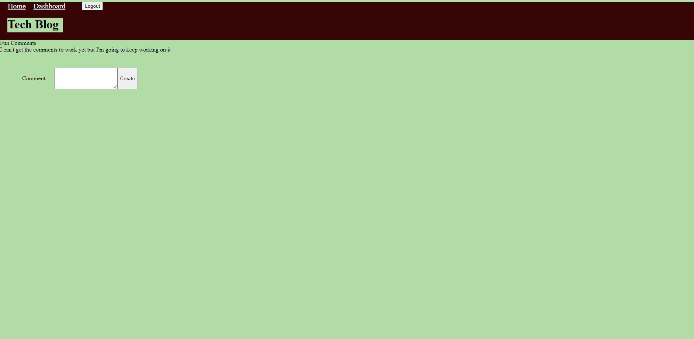
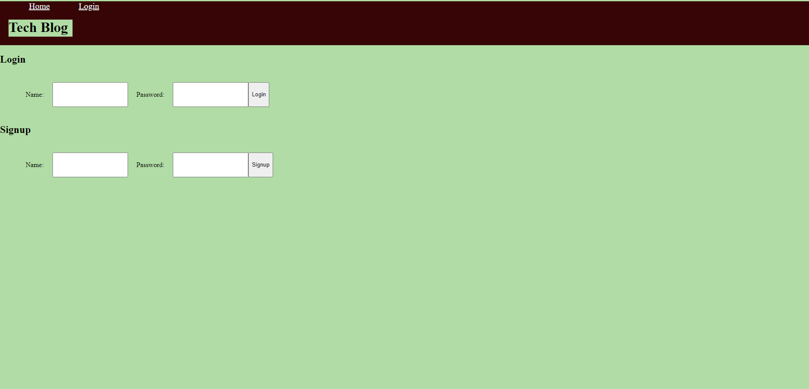

# blogging-mvc

## Description

I visit the site for the first time
 I am presented with the homepage, which includes existing blog posts if any have been posted; navigation links for the homepage and the dashboard; and the option to log in. I click on the homepage option and I am taken to the homepage
where can click on any other links in the navigation. I am prompted to either sign up or sign in
 I choose to sign up, I am prompted to create a username and password
then I click on the sign-up button my user credentials are saved and I am logged into the site.
 I revisit the site at a later time and choose to sign in. I am prompted to enter my username and password
I see navigation links for the homepage, the dashboard, and the option to log out.
 I click on the homepage option in the navigation and I am taken to the homepage and presented with existing blog posts that include the post title. I click on an existing blog post and I am presented with the post title, contents, post creator’s and username for that post and have the option to leave a comment.
 I enter a comment and click on the submit button while signed in, the comment is saved and the post is updated to display the comment, the comment creator’s username. I click on the dashboard option in the navigation, I am taken to the dashboard and presented with any blog posts I have already created and the option to add a new blog post.
I click on the button to add a new blog post and then I am prompted to enter both a title and contents for my blog post
 I click on the button to create a new blog post the title and contents of my post are saved and I am taken back to an updated dashboard with my new blog post. I click on one of my existing posts in the dashboard. I am able to delete or update my post and taken back to an updated dashboard
I click on the logout option in the navigation, I am signed out of the site
I am idle on the site for more than a set time
I am able to view comments but I am prompted to log in again before I can add, update, or delete comments

## Installation
Install npm, MYSQL2, Sequilize, Express-handlebars, dotenv package, bcrypt, express-session and connect-session-sequilize

## Github URL
https://github.com/Jacobschoenbauer/blogging-mvc

## Picture
 

 

 
## URL
https://working-blog.herokuapp.com/